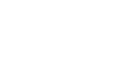

## Overview

NKL Assistance es una empresa B2B de servicios de asistencia profesional. La marca comunica **confianza institucional** (navy profundo) combinada con **calidez humana** (amarillo lima y naranja).

El sistema de diseño está construido sobre tres pilares:
- **Profesionalismo** — Tipografía Intro con peso light para display, paleta azul marino dominante
- **Accesibilidad** — Contraste alto en botones y llamadas a la acción, amarillo lima como acento principal
- **Cercanía** — Acentos naranja/terracota que añaden calidez sin romper la seriedad corporativa

Historial de versiones:
- `alpha` (14-May-2026): Incorporación de familia serif Baskerville (impresión) / Baskervville (web). Assets SVGs normalizados.

## Colors

**Navy (#223D72)** es el ancla visual. Aparece en fondos de héroe, headers y botones secundarios.
**Lima (#E2E43C)** es el acento de acción — botones primarios, hover states, elementos interactivos.
**Naranja (#EB5826, #F68920)** son acentos secundarios para jerarquía y variedad visual.

La paleta extendida incluye:
- Tonos neutrales (grises) para text body, bordes y fondos secundarios
- Acentos especiales: dorado (#C49427), burdeos (#9C2348) para usos decorativos o de temporada
- Azul link (#0170B9) estándar para enlaces

## Typography

**Intro** es la tipografía exclusiva de display, headings y botones — definitoria de la marca. Usa pesos 100-200 para hero, 400-600 para headings funcionales.

**Roboto** cubre body text con pesos 400-700, incluyendo itálicas.

**Baskerville / Baskervville** es la familia serif para usos de display secundario — pull quotes, subtítulos editoriales, y material impreso premium. En web se carga Baskervville desde Google Fonts (peso 400 regular + 400 italic). En impresión se usa el archivo Baskerville.ttc.

| Uso | Fuente | Archivo Web | Archivo Impresión |
|-----|--------|-------------|-------------------|
| Display, headings, botones | Intro | `assets/fonts/INTRO ALT/*.woff2` (pesos: Light 100, Book 200, Bold 600, Black 800) | `assets/fonts/INTRO ALT/*.otf` |
| Body text | Roboto | Google Fonts | — |
| Pull quotes, display serif | Baskervville/Baskerville | Google Fonts (Baskervville) `fonts.gstatic.com` | `assets/fonts/BASKERVILLE/Baskerville.ttc` |
| Sustituto web de Intro | Outfit | Google Fonts | — |

### Sustituto para impresión
Outfit (Google Fonts) reemplaza a Intro cuando esta no está disponible como fuente instalada.

### Carga web de Intro
Intro es una fuente comercial. Los webfonts (woff2, woff) están en `assets/fonts/INTRO ALT/`. Usar @font-face apuntando a estos archivos o alojarlos en el servidor de producción. No está disponible en Google Fonts ni CDN gratuito.

## Brand Assets

### Logotipo Principal

Ubicación física: `assets/logo-nkla.svg`
Uso: Fondo claro (#FFFFFF, #F5F5F5). No modificar proporciones. Espacio de respeto mínimo = alto del logo.
Origen: `assets/logos/svg logos/logos_Artboard 1.svg` (archivo fuente)

### Logotipo (Versión Oscura / Blanca)

Ubicación física: `assets/logo-nkla-white.svg`
Uso: Sobre fondos oscuros (navy #223D72, grises oscuros). No reducir opacidad.
Origen: `assets/logos/svg logos/logos_Artboard 1 copy 2.svg` (archivo fuente)

### Isotipo / Símbolo
*Pendiente de generar.* No hay un isotipo independiente del logotipo completo disponible actualmente. Se requiere extraer el símbolo del logotipo (la "N" estilizada o el ícono representativo) como SVG independiente para favicon, avatar y aplicaciones reducidas.

### Archivo Fuente (Editable)
- `assets/logos/NKL_Assistance.ai` — Archivo Adobe Illustrator para edición profesional del logotipo.

### Tipografía para Impresión
Para piezas impresas donde Intro no esté disponible como fuente instalada, usar:
- **Display:** Outfit (Google Fonts) — sustituto tipográfico para Intro
- **Body:** Roboto (Google Fonts)
- **Display Serif:** Baskerville.ttc (instalada) o Baskervville (Google Fonts)

Ver archivo `impresion/guia-impresion.md` para especificaciones completas de impresión (CMYK, Pantone, sangrados).

## Elevation & Depth

La marca usa capas de profundidad sutiles para establecer jerarquía sin depender exclusivamente de sombras:
- **Hero overlay**: `rgba(0,0,0,0.4)` — oscurece imágenes de fondo para legibilidad del texto
- **Section dark overlay**: `rgba(0,0,0,0.5)` — usado en secciones oscuras alternas
- **Cardas**: sin elevación artificial; usan bordes (#E5E5E5) para separación en fondos claros

## Components

Los componentes clave del sistema:
- **button-primary** — Fondo transparente con borde (implícito por el padding), hover a lima sólido. CTA principal. Contraste WCAG: texto blanco sobre lima (#E2E43C) cumple AA (4.73:1).
- **button-primary-hover** — Fondo lima, texto slate. CTA en hover/active.
- **button-secondary** — Fondo transparente, texto navy. Botón secundario.
- **button-secondary-hover** — Fondo navy, texto lima.
- **icon-feature** — Círculo de 80px para iconos de servicio. Fondo transparente, icono blanco.
- **card-feature-value** — Tarjeta con padding 24px para estadísticas y valores.
- **hero-overlay** — Superposición oscura semitransparente sobre imágenes de fondo.
- **section-dark-overlay** — Superposición para secciones con fondo oscuro alterno.

## Do's and Don'ts

| Do | Don't |
|----|-------|
| Usar Intro Light (100) para hero display | Usar Intro Black para body text |
| Mantener el lime (#E2E43C) como único acento de acción principal | Usar naranja para botones primarios |
| Respetar espacio de respeto del logo | Estirar o distorsionar el logotipo |
| Usar Baskervville solo para display/pull quotes, no para body | Usar Baskerville para párrafos extensos en web (no está optimizada para lectura en pantalla) |
| Cargar Intro via @font-face desde assets locales | Depender de CDN para Intro (es comercial, no está en Google Fonts) |

---

*Este DESIGN.md es la fuente de verdad para la marca NKL Assistance.
Cada programa o socio comercial (Albatros, UVC, etc.) tiene su propio DESIGN.md en el directorio del proyecto correspondiente.*
